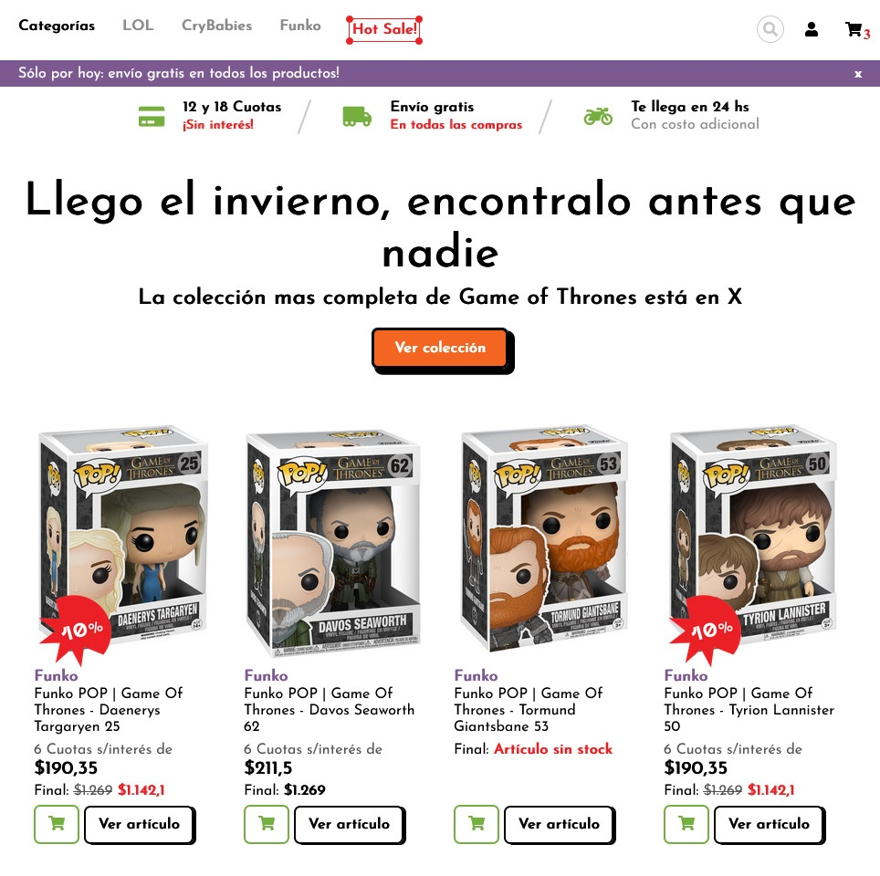

## DESAFIO CRUCE 2022

Desafio desarrollado para https://www.e-cruce.com/

### Criteriors de evaluacion

* Fidelidad al prototipo.
* Buenas prácticas/ código limpio.
* Adaptación responsive.

### Autor

Desarrollado por...
Matias Derlich
https://www.linkedin.com/in/ingmderlich/

### Fecha

04/09/2022

## Imagen de referencia

